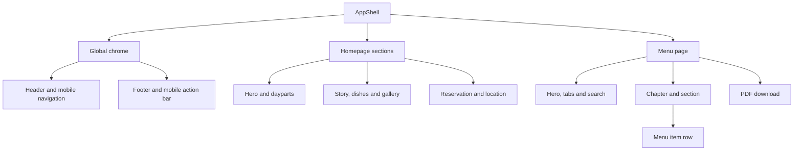

# MONARQ Premium Restaurant Website

## Master design and build specification

Version: 1.0  
Prepared: 13 August 2026  
Primary language: French  
Market: Tangier, Morocco  
Brand line: **BRUNCH · RESTAURANT · CAFÉ**

---

## 1. Purpose of this file

Use this document as the single master brief for designing and building the official MONARQ restaurant website.

The final result must feel premium, contemporary and unmistakably MONARQ. It must reuse the approved menu system, exact logo assets, typography, warm ivory background, black typography, antique-gold details and culinary engraving style already established for the printed menu.

This is not a generic restaurant template. Every design decision must support one of these visitor goals:

1. Understand what MONARQ offers.
2. Explore the complete menu comfortably on a phone.
3. Reserve a table or contact the restaurant.
4. Get directions and opening hours.
5. See the atmosphere, dishes and MONARQ identity.

## 2. Required source assets

Before writing UI code, locate and inspect all of these assets. Do not replace, redraw or approximate them.

| Priority | Asset | Required use |
| --- | --- | --- |
| 1 | `MONARQ_Menu_A3_Red_Chili_Pasta_Adjusted.pdf` | Authoritative source for current menu names, descriptions, prices, categories, hierarchy, gold-accent engravings and red chili markers. |
| 2 | `Monarq_logo-png-white-3(4).png` | Exact MONARQ wordmark for dark surfaces and hero/header treatments. |
| 3 | `Monarq_symbol-png.png` | Exact circular MONARQ seal for section signatures, favicon/source icon, footer and subtle watermark use. |
| 4 | `Perpetua Titling MT Std Light.otf` | Display and editorial title font. |
| 5 | `Fontspring-facundo-regular.otf` | Dish names, interface labels and supporting copy. |
| 6 | `MONARQ Restaurant Design System Board.png` | Layout and mood reference only. Its sample dishes, chef name, address, phone, hours and other factual content are not approved MONARQ data. |
| 7 | Approved MONARQ food/interior photography | Hero, gallery, story and signature-dish modules. Use real MONARQ photography wherever available. |
| 8 | Approved antique-gold culinary engraving PNG files | Decorative section art and menu-category imagery. Use only supplied files; never draw substitutes in CSS or SVG. |

### Asset precedence

If two sources conflict, use this order:

1. Latest approved menu PDF.
2. Exact logo and symbol assets.
3. This specification.
4. Design system board as a visual reference only.
5. External inspiration sites as structural inspiration only.

Never copy factual content from a mood board or inspiration website.

## 3. Non-negotiable brand rules

- Keep the exact MONARQ logo geometry, custom M and existing Q.
- Do not add a fork, crown, chef hat or other restaurant cliché to the logo.
- Do not rebuild the logo with live text.
- Use a warm white or ivory background as the dominant surface.
- Use near-black typography and fine antique-gold accents.
- Reserve bright red exclusively for the approved spicy chili marker and critical form errors.
- Keep gold restrained. It is an accent, not a background treatment.
- Avoid green as a website brand colour.
- Do not use heavy gradients, glassmorphism, neon effects, oversized rounded cards or generic luxury black-and-gold clichés.
- Do not use emoji as interface icons.
- Do not create long empty areas simply to make the website feel luxurious.
- Do not use fake awards, reviews, chef names, addresses, phone numbers, opening hours or reservation confirmations.
- Do not change menu wording or prices while transferring content to the website.
- All customer-facing copy must be polished French with correct accents and punctuation.

## 4. Brand and experience concept

### Core idea

**Editorial Tangier brasserie with contemporary warmth.**

The website should combine the quiet precision of the printed menu with the sensory atmosphere of a refined all-day restaurant. It should feel elegant and welcoming rather than formal or cold.

### Brand attributes

- Refined
- Warm
- Contemporary
- Generous
- Crafted
- Cosmopolitan with a clear Tangier identity
- Premium without pretension

### Visitor impression

Within five seconds, a visitor should understand that MONARQ is a premium place in Tangier for brunch, restaurant dining, café moments and desserts.

## 5. Visual design system

### 5.1 Colour tokens

Use the palette below as the default implementation. Sample final production values against the approved menu artwork before launch.

```css
:root {
  --monarq-paper: #fdfaf5;
  --monarq-paper-soft: #f7f5ef;
  --monarq-white: #ffffff;
  --monarq-ink: #181512;
  --monarq-black: #0a0a0a;
  --monarq-ink-soft: #554a40;
  --monarq-gold: #a7916c;
  --monarq-gold-deep: #8b6a3d;
  --monarq-line: #d9d5ce;
  --monarq-line-strong: #bdbab5;
  --monarq-chili: #ff1f2d;
  --monarq-error: #b42318;
  --monarq-success: #236341;
}
```

### Colour usage ratio

- 75-85% warm ivory and white.
- 10-18% black and deep charcoal.
- Maximum 5% antique gold.
- Less than 1% red chili accent.

### 5.2 Typography

Use the supplied fonts through local `@font-face` declarations. Convert to WOFF2 only when the font licence permits it.

```css
@font-face {
  font-family: "Monarq Titling";
  src: url("/fonts/perpetua-titling-light.woff2") format("woff2");
  font-style: normal;
  font-weight: 300;
  font-display: swap;
}

@font-face {
  font-family: "Monarq Facundo";
  src: url("/fonts/facundo-regular.woff2") format("woff2");
  font-style: normal;
  font-weight: 400;
  font-display: swap;
}
```

Font roles:

| Role | Font | Treatment |
| --- | --- | --- |
| H1 and major editorial titles | Monarq Titling | Light weight, uppercase or refined title case, controlled letter spacing. |
| Section headings and menu category names | Monarq Titling | Uppercase, `0.06em-0.12em` tracking. |
| Dish names and primary UI labels | Monarq Facundo | Regular, high contrast against background. |
| Descriptions and longer body copy | Monarq Facundo, then Arial/sans-serif fallback | Comfortable line height and short line length. |
| Optional editorial quotation | Georgia fallback | Use sparingly and never for interface controls. |

Recommended responsive type scale:

| Element | Desktop | Mobile |
| --- | ---: | ---: |
| Hero H1 | `clamp(3.5rem, 7vw, 7rem)` | `clamp(2.6rem, 12vw, 4.2rem)` |
| Page H1 | `clamp(3rem, 5vw, 5.25rem)` | `2.6rem-3.5rem` |
| Section H2 | `clamp(2.1rem, 3.5vw, 3.75rem)` | `2rem-2.7rem` |
| Category H3 | `1.35rem-1.65rem` | `1.15rem-1.35rem` |
| Dish name | `1.05rem-1.15rem` | `1rem-1.08rem` |
| Body | `1rem-1.1rem` | `0.98rem-1.05rem` |
| Small label | `0.72rem-0.82rem` | `0.7rem-0.78rem` |

Typography rules:

- Never use all caps for paragraphs.
- Keep body line length between 45 and 72 characters.
- Use French non-breaking spacing before `:`, `;`, `?` and `!` where the rendering system supports it.
- Preserve all French accents and apostrophes.
- Do not allow title text to collide with images or navigation.
- Verify the provided Facundo font licence before public deployment; the supplied filename indicates a demo build.

### 5.3 Grid and spacing

- Maximum content width: `1440px`.
- Editorial text width: `680px-760px`.
- Desktop grid: 12 columns, `24px-32px` gutters.
- Tablet grid: 8 columns, `20px-24px` gutters.
- Mobile grid: 4 columns, `16px-20px` side padding.
- Section spacing: `96px-144px` desktop, `64px-88px` mobile.
- Component spacing uses an 8px base rhythm.
- Prefer clean 90-degree geometry and very small radii (`0-6px`).
- Use fine `1px` borders in `--monarq-line` or `--monarq-ink`.

### 5.4 Signature details

Reuse these motifs from the printed menu:

- Fine horizontal rules.
- Small antique-gold diamonds between rules.
- Large white space balanced by meaningful imagery and content.
- Warm marble veining used very softly, never as a busy full-page texture.
- Antique culinary engravings with charcoal linework and restrained gold highlights.
- The circular MONARQ symbol as a seal, watermark or section signature.

Do not recreate the diamond, engraving or seal with text characters or hand-built SVG. Use an approved icon/asset or a simple CSS rotated square only when it is purely geometric and visually identical.

### 5.5 Photography direction

Photography must feel authentic to MONARQ:

- Bright but soft directional light.
- Warm-neutral white balance.
- Black, white, marble and forest-toned interior details may appear naturally in photography, but green is not a UI colour.
- Real plates, tables, service details and architecture.
- Premium editorial crop with food texture clearly visible.
- Mix of wide atmosphere, medium table moments and close dish details.
- Avoid generic stock photos, fake staff, excessive steam effects and unrealistic AI food.

Required shot list:

1. One wide hero image or short silent hero video.
2. Exterior/entrance image.
3. Main dining room image.
4. Table-detail image with MONARQ branding.
5. Four to eight exact dishes from the current menu.
6. Brunch spread.
7. Coffee service.
8. Dessert or ice-cream composition.
9. One service or hospitality moment without showing unapproved staff identities prominently.

## 6. Information architecture

Build a complete responsive website with these routes:

| Route | Purpose |
| --- | --- |
| `/` | Premium overview and main conversion page. |
| `/menu` | Complete searchable, filterable and accessible web menu. |
| `/a-propos` | MONARQ story, atmosphere and philosophy. |
| `/galerie` | Food and restaurant photography. |
| `/reservation` | Reservation flow or verified external booking handoff. |
| `/contact` | Address, map, hours, phone, WhatsApp, social links and practical information. |
| `/mentions-legales` | Legal notice and business information. |
| `/politique-de-confidentialite` | Privacy and data-processing information. |

If the project must launch as a single page first, preserve the same section order and URL anchors, but keep the architecture ready to split into routes later.

## 7. Global navigation

### Desktop header

- Left: exact MONARQ wordmark.
- Centre/right: `Accueil`, `La carte`, `À propos`, `Galerie`, `Contact`.
- Primary CTA: `Réserver une table`.
- Header can begin transparent over a dark hero, then become a warm-ivory surface on scroll.
- On a light surface, use a verified monochrome black logo export or apply a reversible monochrome CSS filter to the exact white PNG. Do not redraw the wordmark.
- Height: approximately `80px-96px` desktop.

### Mobile header

- Compact exact wordmark.
- Accessible menu button with a real menu icon from the chosen icon library.
- Full-height menu drawer with large tap targets.
- Keep `Réserver` visible as the primary action.
- Add a bottom action bar only when useful: `Appeler`, `Itinéraire`, `Réserver`.

### Header behaviour

- Current page state must be visible.
- Keyboard focus must be obvious.
- Navigation must close after selecting a link on mobile.
- Header must not cover anchor targets.

## 8. Homepage specification

### 8.1 Hero

Use one strong real MONARQ image or a short muted loop. Do not use a rotating slider.

Content:

```text
BRUNCH · RESTAURANT · CAFÉ

L’élégance à table,
du matin au soir.

À Tanger, MONARQ réunit brunchs généreux, cuisine de caractère,
café et douceurs dans un cadre raffiné.

[Découvrir la carte] [Réserver une table]
```

Hero requirements:

- Full viewport impact without hiding navigation or CTAs below the fold.
- Dark image overlay only as strong as needed for contrast.
- Exact wordmark must remain crisp.
- Desktop copy width: about 5-6 grid columns.
- Mobile crop must preserve the dish/interior focal point.
- Respect `prefers-reduced-motion` and provide a static poster image.

### 8.2 Daypart introduction

Introduce the three main experiences as editorial links, not generic cards:

1. **Le matin** — Petits déjeuners, brunchs, tartines, croques et omelettes.
2. **La cuisine** — Entrées, salades, pâtes, risottos, pizzas, grillades et plats marocains.
3. **Douceurs & boissons** — Cafés, jus, mocktails, desserts, crêpes, gaufres et glaces.

Use one supplied engraving per experience. Keep the layout asymmetrical but balanced.

### 8.3 MONARQ story

Suggested draft copy:

```text
UNE TABLE PENSÉE POUR CHAQUE MOMENT

MONARQ accompagne la journée, du premier café au dîner.
Une carte généreuse, une présentation soignée et une atmosphère
élégante composent une expérience faite pour être partagée.
```

Pair the copy with a real interior photograph and the circular MONARQ symbol. Keep this draft editable until the owner approves the final brand story.

### 8.4 Signature menu highlights

Feature only real items from the current menu. Recommended initial set:

| Item | Current price | Website treatment |
| --- | ---: | --- |
| Le Monarq | 99 DH | Hero brunch signature. Use exact menu description. |
| Un dimanche à Paris | 89 DH | Brunch editorial feature. Use exact menu description. |
| Monarq crevettes | 98 DH | Pasta signature with approved red chili icon. |
| Filet pur Black Angus | 219 DH | Grill highlight. Do not invent a description. |
| Saint-Sébastien | 49 DH | Dessert highlight. Do not invent ingredients. |

Use three to five highlights at once. Each card requires a real matching dish photograph; if no verified photo exists, use an elegant text-and-engraving treatment instead of a wrong image.

CTA: `Voir toute la carte`.

### 8.5 Menu story strip

Create a horizontal editorial strip that shows the six printed-menu chapters:

- Le matin
- À la carte du matin
- La cuisine
- Pizzas & grillades
- Boissons
- Douceurs

Each chapter links directly to its anchor on `/menu`.

### 8.6 Gallery preview

- Use a four- to six-image editorial mosaic.
- Preserve image aspect ratio and focal point.
- Do not mix unrelated colour grading.
- Add CTA: `Découvrir MONARQ en images`.

### 8.7 Reservation band

Use a confident near-black or ivory bordered section with the exact symbol.

```text
VOTRE TABLE VOUS ATTEND

Pour un brunch, un déjeuner, un dîner ou un moment à partager.

[Réserver une table]
```

If an approved booking provider exists, show date, time and guests. Otherwise, route to `/reservation` or verified WhatsApp. Never show a fake confirmed state.

### 8.8 Location and hours

Show:

- Verified MONARQ address.
- Verified opening hours.
- Phone and WhatsApp.
- `Obtenir l’itinéraire` link.
- Optional static map preview with an accessible text alternative.
- Official Instagram: `@monarq.tanger`.

Do not reuse the old inspiration restaurant’s address, phone or email unless the owner confirms they are now MONARQ’s official details.

## 9. Complete menu page

The PDF may be offered as a secondary download, but the primary menu must be native HTML for mobile readability, accessibility and search engines.

### 9.1 Page header

```text
LA CARTE MONARQ

Du petit déjeuner aux douceurs, découvrez une carte pensée
pour chaque moment de la journée.
```

Show two secondary actions:

- `Télécharger le menu PDF`
- `Réserver une table`

### 9.2 Navigation and filters

Use a sticky category navigation under the main header:

- Tous
- Le matin
- À la carte du matin
- La cuisine
- Pizzas & grillades
- Boissons
- Douceurs

Optional filters, only when useful:

- Search by dish name.
- `Végétarien` if confirmed from menu data.
- `Épicé` for approved chili-marked items.
- `Disponible le matin` when approved service hours exist.

Do not add dietary labels by guessing from ingredients. Vegetarian, vegan, halal, gluten-free and allergen labels require restaurant confirmation.

### 9.3 Exact menu hierarchy

Create all categories and sections below using the exact text and prices from `MONARQ_Menu_A3_Red_Chili_Pasta_Adjusted.pdf`.

| Chapter | Sections |
| --- | --- |
| Le matin | Petits déjeuners; Brunchs |
| À la carte du matin | Tartines; Croques; Omelettes; À la carte; Accompagnements & suppléments |
| La cuisine | Entrées froides; Entrées chaudes; Salades; Pâtes; Risottos; Suppléments salés |
| Pizzas & grillades | Pizzas; Burgers; Viandes; Ribs; Plats marocains; Suppléments pizzas |
| Boissons | Cafés; Thés; Eaux; Jus frais — base au choix; Boissons fraîches; Mojitos; Mocktails; Detox; Ice Coffee; Ice Tea |
| Douceurs | Desserts; Crêpes; Gaufres liégeoises; Glaces; Suppléments sucrés |

### 9.4 Menu item component

Each item contains:

- Name.
- Optional approved red chili marker.
- Price with `DH` visually clarified at chapter or page level.
- Exact description when present.
- Optional confirmed availability note such as `Disponible le vendredi`.

Desktop row pattern:

```text
Nom du plat ........................................ 89
Description exacte du menu.
```

Mobile row pattern:

- Name and price on the same first line.
- Description below.
- Minimum `16px` readable body size.
- No dotted leaders if they reduce readability.

### 9.5 Chili icon rule

Place the same small approved red chili icon next to:

- `Monarq crevettes`
- `Monarq poulet`

Use `--monarq-chili: #ff1f2d`. Keep it approximately `14px-18px`, align it to the text baseline and provide an accessible label such as `Plat épicé` without repeating it visually. Do not use an emoji pepper.

Do not automatically mark other dishes as spicy unless the restaurant approves the label.

### 9.6 Menu integrity

- Use the latest PDF, not an older CSV, Excel file or menu draft.
- Keep the exact item choice logic, including `bacon de bœuf ou saumon fumé` where shown.
- Keep `Disponible le vendredi` on both couscous items.
- Preserve `Le Monarq`, `Monarq crevettes` and `Monarq poulet` as separate approved names.
- Use numeric prices from the PDF and display the currency consistently as DH.
- Do not silently correct, combine or rewrite menu descriptions during implementation. Flag suspected source errors for owner review in a separate list.

## 10. About page

Recommended structure:

1. Editorial hero with interior photography.
2. Short MONARQ story.
3. Three principles: generosity, care and atmosphere.
4. Restaurant/interior image sequence.
5. Day-to-night experience.
6. Reservation CTA.

Do not create a chef-founder story unless the owner provides the real name, biography and approved photograph.

## 11. Gallery page

Categories:

- Le lieu
- Le brunch
- La cuisine
- Boissons & douceurs
- Moments MONARQ

Requirements:

- Responsive masonry or editorial grid with stable image dimensions.
- Keyboard-accessible lightbox.
- Descriptive French alt text.
- Lazy-load below-the-fold imagery.
- Never stretch images.
- Preserve consistent colour grading.
- Instagram link uses the verified official profile.

## 12. Reservation page

Preferred fields:

- Nom complet
- Téléphone
- Date
- Heure
- Nombre de personnes
- Occasion, optional
- Message, optional
- Consent checkbox with privacy link

Requirements:

- Use the restaurant’s approved booking provider when one exists.
- If no provider exists, send the request to a verified endpoint or open a prefilled verified WhatsApp conversation.
- Show inline validation in French.
- Never claim a reservation is confirmed unless the restaurant’s system actually confirms it.
- Distinguish `Demande envoyée` from `Réservation confirmée`.
- Include phone fallback.
- Prevent duplicate submission.

Suggested confirmation copy for a request-only flow:

```text
Votre demande a bien été envoyée.
L’équipe MONARQ vous contactera pour confirmer la disponibilité.
```

## 13. Contact page

Include only verified values for:

- Address
- Google Maps URL
- Phone
- WhatsApp
- Email
- Opening hours
- Reservation method
- Parking or accessibility information
- Instagram

Use the content variables in Section 22 until the owner supplies final details.

## 14. Footer

Desktop footer structure:

1. Exact MONARQ logo and symbol.
2. Navigation.
3. Address and hours.
4. Phone, WhatsApp and email.
5. Instagram.
6. Legal and privacy links.
7. Copyright year generated dynamically.

Mobile footer should stack cleanly and keep tap targets at least `44px` high.

## 15. Interaction and motion

Motion must be quiet and purposeful:

- `180ms-280ms` transitions.
- Subtle fade/translate on first reveal.
- Fine underline movement on links.
- Gentle image scale no greater than `1.03` on hover.
- No scroll-jacking.
- No large parallax on mobile.
- No autoplay audio.
- Honour `prefers-reduced-motion` globally.

## 16. Responsive behaviour

### Mobile first

The majority of restaurant discovery will happen on a phone. Design the menu, contact actions and reservation flow for mobile before expanding to desktop.

Required checks:

- `360px`, `390px`, `430px` mobile widths.
- `768px-1024px` tablet widths.
- `1280px`, `1440px`, `1920px` desktop widths.
- Landscape phone orientation.
- Long French dish names and descriptions.
- Browser zoom at 200%.

Mobile rules:

- Never use two menu columns on narrow screens.
- Keep price visible without forcing horizontal scrolling.
- Sticky category tabs may scroll horizontally with visible overflow cues.
- Keep contact and reservation actions easy to reach.
- Do not hide essential information behind hover.

## 17. Accessibility

Target WCAG AA quality.

- Semantic landmarks and heading order.
- Skip-to-content link.
- Keyboard navigation for all controls.
- Visible focus states.
- Form labels remain visible; placeholders are not labels.
- Text contrast at least 4.5:1 for normal text.
- Alternative text describes the actual MONARQ image.
- Decorative engraving images use empty alt text.
- Menu categories use headings and anchored navigation.
- Chili icon includes accessible text.
- Errors are announced and linked to affected fields.
- Lightbox and mobile drawer trap focus correctly and close with Escape.

## 18. Performance

Targets on a realistic mobile connection:

- LCP under 2.5 seconds.
- CLS under 0.1.
- INP under 200 milliseconds when practical.
- Lighthouse Performance, Accessibility, Best Practices and SEO scores of 90 or higher on key pages.

Implementation rules:

- Use responsive AVIF/WebP images with explicit width and height.
- Preload only the hero image and essential display font.
- Self-host approved fonts.
- Subset fonts only if French characters remain complete.
- Lazy-load gallery and below-the-fold imagery.
- Use a poster image for hero video.
- Avoid heavy animation libraries for simple transitions.
- Avoid shipping the full PDF to visitors unless they choose to download it.

## 19. SEO and sharing

### Core SEO

- Unique French title and description per route.
- One clear H1 per page.
- Canonical URLs.
- XML sitemap and robots configuration.
- Open Graph and social preview image using exact MONARQ identity.
- Restaurant structured data populated only with verified details.
- Menu page indexable as HTML.
- Address and phone formatted consistently.

Suggested homepage metadata draft:

```text
Title: MONARQ Tanger — Brunch, Restaurant & Café
Description: Découvrez MONARQ à Tanger : brunchs, cuisine généreuse,
café, boissons et douceurs dans une atmosphère élégante.
```

Do not claim `meilleur restaurant`, `n°1`, awards or review scores without verified evidence.

## 20. Content model

Keep content editable through a CMS, local structured data or a clearly separated content layer.

### Site settings

```ts
type SiteSettings = {
  restaurantName: "MONARQ";
  tagline: string;
  address: string;
  mapsUrl: string;
  phoneDisplay: string;
  phoneHref: string;
  whatsappUrl: string;
  email: string;
  instagramUrl: string;
  openingHours: OpeningHours[];
  reservationMode: "provider" | "form" | "whatsapp" | "phone";
  reservationUrl?: string;
};
```

### Menu data

```ts
type MenuChapter = {
  id: string;
  title: string;
  order: number;
  availabilityNote?: string;
  sections: MenuSection[];
};

type MenuSection = {
  id: string;
  title: string;
  order: number;
  items: MenuItem[];
};

type MenuItem = {
  id: string;
  name: string;
  description?: string;
  price?: number;
  currency: "DH";
  spicy?: boolean;
  availabilityNote?: string;
  image?: {
    src: string;
    alt: string;
  };
};
```

Do not infer `spicy`, allergens or dietary labels from free text. Enter only explicitly approved values.

## 21. Recommended technical approach

Respect the existing project stack if a codebase already exists. For a greenfield build, use:

- React framework with server-rendered routes.
- TypeScript.
- Semantic HTML and component-scoped styling or a disciplined utility system.
- Responsive image optimisation.
- Structured menu data stored outside component files.
- A real form/action endpoint or verified reservation-provider integration.
- No unnecessary database for static menu content unless the owner needs live editing.

Recommended component map:



## 22. Required content variables

Do not publish until these values are supplied and verified:

```env
MONARQ_ADDRESS="{{OWNER_TO_CONFIRM}}"
MONARQ_GOOGLE_MAPS_URL="{{OWNER_TO_CONFIRM}}"
MONARQ_PHONE_DISPLAY="{{OWNER_TO_CONFIRM}}"
MONARQ_PHONE_HREF="{{OWNER_TO_CONFIRM}}"
MONARQ_WHATSAPP_URL="{{OWNER_TO_CONFIRM}}"
MONARQ_EMAIL="{{OWNER_TO_CONFIRM}}"
MONARQ_OPENING_HOURS="{{OWNER_TO_CONFIRM}}"
MONARQ_RESERVATION_URL="{{OWNER_TO_CONFIRM}}"
MONARQ_INSTAGRAM_URL="https://www.instagram.com/monarq.tanger/"
```

Do not copy contact information from `lelambermont.ma` without explicit confirmation that MONARQ retained it.

## 23. Build sequence for Codex

1. Inspect the source assets and existing codebase.
2. Confirm the latest menu PDF filename and render all six pages for visual reference.
3. Create brand tokens, local font loading and global layout primitives.
4. Build the responsive header, footer and shared CTA components.
5. Build the homepage in the exact section order in this brief.
6. Transfer the complete current PDF menu into structured data without rewriting it.
7. Build the native HTML menu with sticky chapter navigation and mobile-first rows.
8. Add the approved chili marker to exactly the two specified pasta dishes.
9. Build the About, Gallery, Reservation and Contact routes.
10. Connect only verified contact, map and reservation data.
11. Add metadata, structured data, sitemap and social preview.
12. Test responsiveness, keyboard access, forms, links and performance.
13. Compare the final UI against the menu and design-system references.
14. Fix all visible inconsistencies before handoff.

## 24. Final quality checklist

### Brand

- [ ] Exact logo used; no reconstructed wordmark.
- [ ] Exact MONARQ symbol used.
- [ ] Perpetua Titling and Facundo roles match the printed menu.
- [ ] Warm ivory, black and antique gold dominate.
- [ ] Red appears only for approved spicy markers and form errors.
- [ ] Engravings use approved assets and remain subtle.
- [ ] No green UI branding.

### Content

- [ ] All menu names, descriptions and prices match the latest PDF.
- [ ] All six menu chapters are present.
- [ ] Both couscous availability notes remain visible.
- [ ] `Monarq crevettes` and `Monarq poulet` have the uniform red chili icon.
- [ ] No other spicy labels were guessed.
- [ ] No fake address, hours, phone, reviews, chef or awards.
- [ ] French spelling and accents are correct.

### Experience

- [ ] Menu is readable and usable at 360px width.
- [ ] Reservation CTA works.
- [ ] Phone, WhatsApp, directions and Instagram links work.
- [ ] Navigation and anchors work with keyboard and touch.
- [ ] Forms show real validation and honest confirmation states.
- [ ] No horizontal overflow or clipped text.
- [ ] Images keep correct proportions and focal points.
- [ ] Reduced-motion preference is respected.

### Technical

- [ ] No console errors.
- [ ] No broken links or missing assets.
- [ ] Local fonts load with correct French glyphs.
- [ ] Images have dimensions and responsive sources.
- [ ] Core pages have correct metadata.
- [ ] Structured data contains only verified business information.
- [ ] Legal and privacy routes exist before collecting reservation data.
- [ ] Performance and accessibility targets are met.

## 25. Definition of done

The website is complete only when:

1. It looks like a digital extension of the approved MONARQ menu and not a generic restaurant theme.
2. The full latest menu is available as native, accessible HTML.
3. Every key mobile action works.
4. All business information is verified.
5. The website passes responsive, accessibility and visual checks.
6. The owner can update menu content and practical information without redesigning pages.

---

## Final instruction to the implementation agent

Build with restraint and precision. Preserve the approved identity, exact menu content and real restaurant assets. When information is missing, keep a clearly labelled content variable and report it rather than inventing it. Prioritise the mobile menu, reservation path, directions and authentic MONARQ atmosphere. Do not stop at a static mockup: deliver a responsive, production-ready website with working navigation, working primary actions and a verified visual finish.
